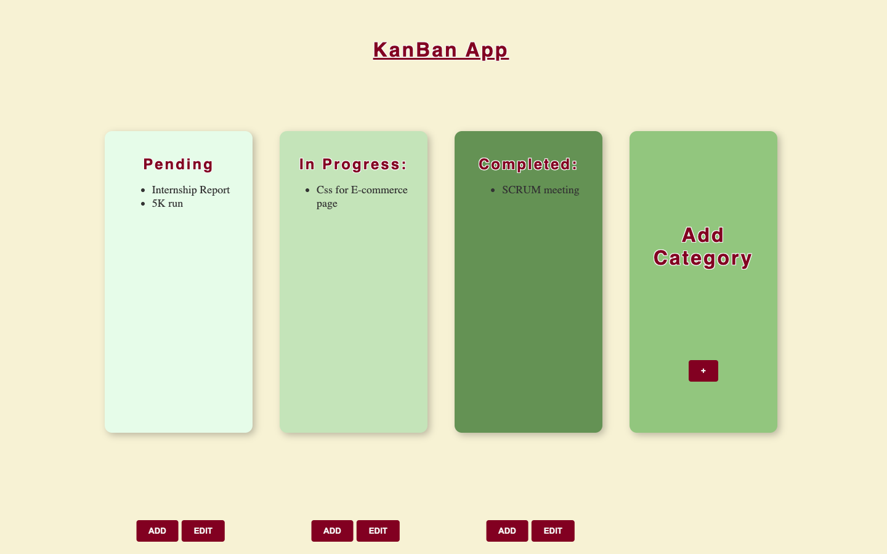

# 🗂️ KanBan Board App


A **Kanban-style task management app** built with **React + Vite**, supporting dynamic task creation, editable categories, and custom workflow columns.

---

## ✨ Features

- Create & edit tasks via popup modals  
- Default columns: **Pending**, **In Progress**, **Completed**  
- Add and switch between **custom categories**  
- Dynamic dropdown-based category updates  
- Unique ID–based task handling  
- Fast dev experience with Vite  

---

## 📸 Screenshots

_Main Kanban Board UI_



---

## 🛠️ Tech Stack

- **React (Hooks)**
- **Vite**
- **CSS**

---

## 🚀 Run Locally

```bash
git clone https://github.com/MaanyataAul004/KanBan-App.git
cd KanBan-App/KanBan_App
npm install
npm run dev
```

👩‍💻 Author
Maanyata Aul
GitHub: @MaanyataAul004

📄 License
Open-source, for learning and personal use.
